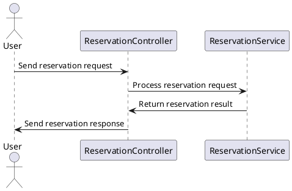

# weverse
위버스 컴퍼니 팬참여 플랫폼 과제

# 📌 Project Name
팬참여 플랫폼 

---

## 🌟 Features

- 🔒 **Secure and Reliable**: Features for ensuring data integrity and security.
- 🚀 **High Performance**: Optimized to handle high volume of transactions smoothly.
- 📱 **Responsive Design**: Fully functional across devices and screen sizes.
- ⚙️ **Configurable**: Customizable settings for various user preferences.

---

## 🛠️ Technologies Used
- **Backend**: Java, Spring Boot, JPA, Kafka
- **Database**: H2 Database, Redis
---

## 📂 Project Structure

---

## 📊 UML Diagram

This PlantUML diagram shows the interaction between a user and the reservation system. The user sends a request to the `ReservationController`, which then communicates with the `ReservationService` to process the reservation and return the result.

